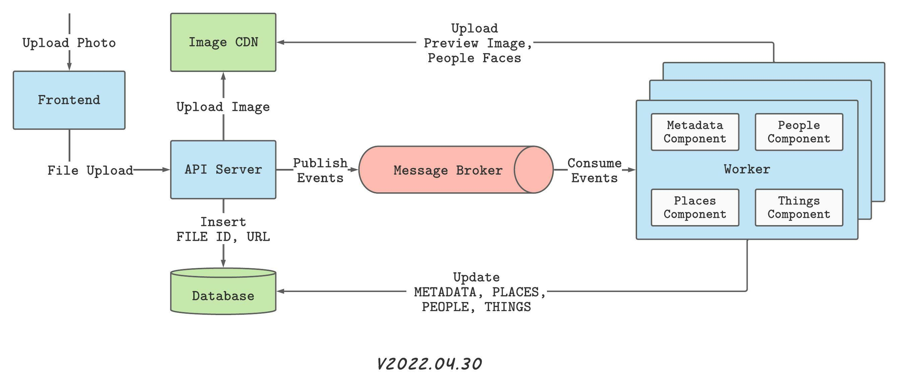

# iris

## About

## Services
- [API](api/README.md)
- [Frontend](frontend/README.md)
- [Worker](worker/README.md)

**Infrastructure Services:**  
- [Database](https://www.mongodb.com)
- [CDN](http://github.com/chrislusf/seaweedfs)
- [Queue](https://www.rabbitmq.com)

## Deployment
TODO: Add Docker related notes

## Issues
Issues are managed via GitHub Issues [here](https://github.com/prabhuomkar/iris/issues).

## Maintainers
- [Omkar Prabhu](https://github.com/prabhuomkar)
- [Akshay Pithadiya](https://github.com/akshaypithadiya)

## License
TODO: Add license
